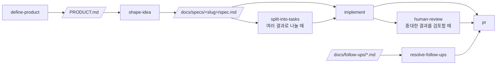

# Where2Dive

[](https://www.claude-hunt.com)
[](https://docs.claude-hunt.com)

> 어드밴스드 자격증을 가진 1인 다이버가 월과 기간을 입력하면, 그 시기에 다이빙 환경이 좋은 동남아 해외 여행지 후보와 예상 견적(다이빙·항공·숙소)을 비교해서 여행 계획을 확정하도록 돕는 서비스입니다.
> 제품 정의는 [PRODUCT.md](PRODUCT.md), 도메인 용어는 [GLOSSARY.md](GLOSSARY.md)에 있습니다.
>
> [Claude Hunt](https://www.claude-hunt.com) 강의용 Next.js 16 + React 19 템플릿으로 만들었습니다. 템플릿 사용법과 워크플로우 문서는 [docs.claude-hunt.com](https://docs.claude-hunt.com)에서 확인하세요.

## 기술 스택

Next.js 16 (App Router) · React 19 · Tailwind CSS 4 · shadcn/ui · react-leaflet(지도) · Supabase(Postgres) · Bun · Vitest · Playwright

## 시작하기

```bash
bun install
```

Supabase 프로젝트의 URL과 publishable 키를 `.env.local`에 설정합니다.

```bash
NEXT_PUBLIC_SUPABASE_URL=https://<project-ref>.supabase.co
NEXT_PUBLIC_SUPABASE_PUBLISHABLE_KEY=sb_publishable_...
```

두 값 모두 [Supabase 대시보드](https://supabase.com/dashboard) → 프로젝트 → Settings → API에서 확인할 수 있습니다.

```bash
bun dev
```

[http://localhost:3000](http://localhost:3000)에서 결과를 확인할 수 있습니다.

## 데이터베이스 (Supabase)

다이빙 목적지 데이터(월별 컨디션, 다이빙·항공·숙소 요금)는 `destinations` 테이블에 저장합니다. 화면 코드는 이 테이블을 직접 알지 못하고 [lib/destinations](lib/destinations)를 통해서만 읽습니다. 배경은 [docs/decisions/travel-data-source.md](docs/decisions/travel-data-source.md)에 있습니다.

- 스키마와 시드 데이터는 [supabase/migrations](supabase/migrations)에 있습니다.
- 로컬 CLI를 프로젝트에 연결한 뒤(`bunx supabase login`, `bunx supabase link --project-ref <project-ref>`) 아래 명령으로 마이그레이션을 적용합니다.

  ```bash
  bunx supabase db push
  ```

- 새 마이그레이션은 `bunx supabase migration new <이름>`으로 만듭니다.

## 스크립트

| 명령어 | 설명 |
|---|---|
| `bun dev` | 개발 서버 실행 |
| `bun run build` | 프로덕션 빌드 |
| `bun start` | 프로덕션 서버 실행 |
| `bun run lint` | ESLint 실행 |
| `bun run typecheck` | `tsc --noEmit` 타입 검사 |
| `bun run test` | Vitest 단위/컴포넌트 테스트 1회 실행 |
| `bun run test:watch` | Vitest watch 모드 |
| `bun run test:e2e` | Playwright E2E 테스트 실행 |

## 테스트

- **단위**: Vitest. 설정은 `vitest.config.mts`, 매처와 cleanup은 `vitest.setup.ts`에 있습니다. 테스트 파일은 소스 옆에 `*.test.ts`로 둡니다(`lib/destinations/pricing.test.ts`, `lib/destinations/filters.test.ts`, `lib/destinations/conditions.test.ts`, `lib/utils.test.ts` 참고). `globals`를 켜지 않았으므로 `describe`/`it`/`expect`는 `vitest`에서 import 합니다. Supabase를 조회하는 `getDestinations`처럼 `async` Server Component에 걸친 흐름은 Vitest가 아직 지원하지 않으므로 E2E로 검증합니다.
- **E2E**: Playwright. 설정은 `playwright.config.ts`, 테스트는 `e2e/*.spec.ts`에 둡니다(검색·필터, 견적, 비교, 레이아웃 흐름). `webServer`가 `bun run dev`를 자동으로 띄우므로 별도 서버 실행이 필요 없습니다. `.env.local`이 설정되어 있어야 목적지 데이터가 조회됩니다.

E2E를 처음 실행하기 전에 브라우저를 한 번 내려받아야 합니다.

```bash
bunx playwright install chromium
```

브라우저가 이미 설치된 환경(예: Claude Code 원격 세션)에서는 내려받는 대신 실행 파일 경로를 지정할 수 있습니다.

```bash
PLAYWRIGHT_CHROMIUM_PATH=/opt/pw-browsers/chromium bun run test:e2e
```

## 프로젝트 문서

- [PRODUCT.md](PRODUCT.md) — 제품 정의(사용자, 문제, 핵심 루프, 경계)
- [GLOSSARY.md](GLOSSARY.md) — 다이빙 도메인 용어와 서비스 개념
- [docs/decisions](docs/decisions) — 구조적으로 굳어진 결정과 그 이유(데이터 소스, 지도 렌더링, 견적 범위 등)
- [docs/specs](docs/specs) — 기능별 스펙과 작업 분해
- [docs/follow-ups](docs/follow-ups) — 이번 세션 범위 밖이라 남겨둔 후속 항목

## Claude Code 워크플로우



파이프라인 밖에서는 `project-knowledge`, `maintain-project-context`, `add-stack-context`, `build-prototype`, `explain-visually`, `tdd`가 각자의 조건에 따라 켜집니다. `project-knowledge`는 `GLOSSARY.md`, `docs/decisions/`, `docs/follow-ups/`에 다음 작업에서도 재사용할 지식과 후속 항목을 남깁니다. Git 작업은 `commit`, `pull`, `push`, `pr`, `merge`가 해당 요청에 맞춰 처리합니다.
